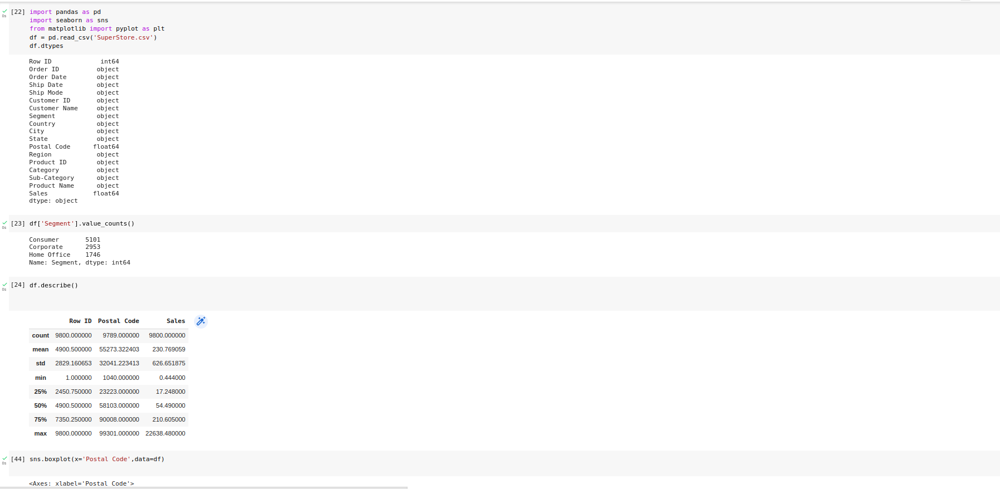
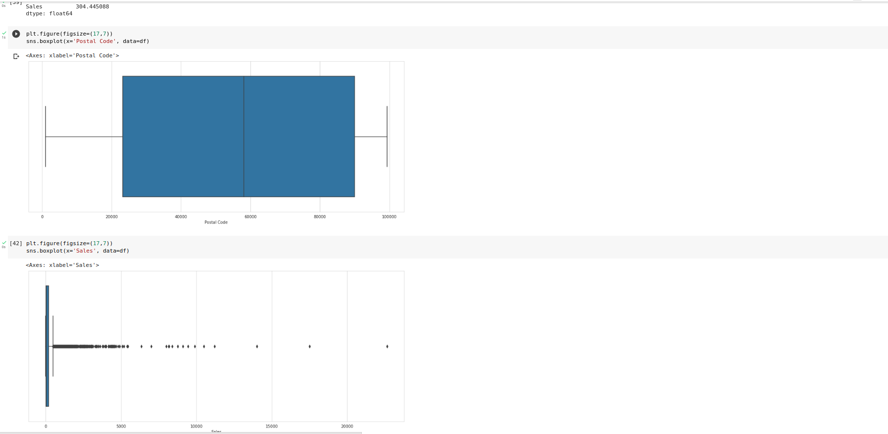

# Ex03-Univariate-Analysis

## CODE

### diabetes.csv
```python
import pandas as pd
import seaborn as sns
from matplotlib import pyplot as plt
df = pd.read_csv('diabetes.csv')
df.dtypes
df['BMI'].value_counts()
df.describe()
sns.boxplot(x='Age',data=df)
sns.countplot(x='Age', data=df)
sns.distplot(df['Age'])
sns.histplot(x='Age',data=df)
df.skew()
sns.histplot(x='Insulin',data=df)
sns.displot(x='BloodPressure', data=df)
df.kurtosis()
plt.figure(figsize=(17,7))
sns.boxplot(x='Insulin', data=df)
plt.figure(figsize=(17,7))
sns.boxplot(x='SkinThickness', data=df)
```

### SuperStore.csv
```python
import pandas as pd
import seaborn as sns
from matplotlib import pyplot as plt
df = pd.read_csv('SuperStore.csv')
df.dtypes
df['Segment'].value_counts()
df.describe()
sns.boxplot(x='Postal Code',data=df)
sns.countplot(x='State', data=df)
sns.distplot(df['Postal Code'])
sns.histplot(x='Postal Code',data=df)
df.skew()
sns.histplot(x='Customer Name',data=df)
sns.displot(x='Ship Mode', data=df)
df.kurtosis()
plt.figure(figsize=(17,7))
sns.boxplot(x='Postal Code', data=df)
plt.figure(figsize=(17,7))
sns.boxplot(x='Sales', data=df)
```

## Output

### diabetes.csv


### SuperStore.csv



